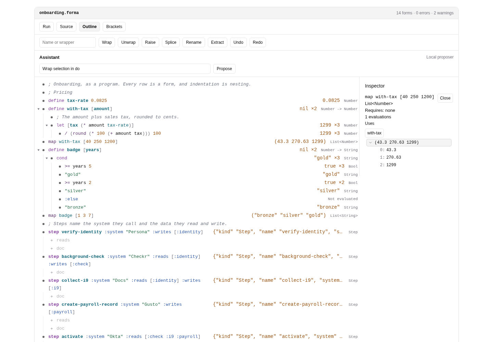
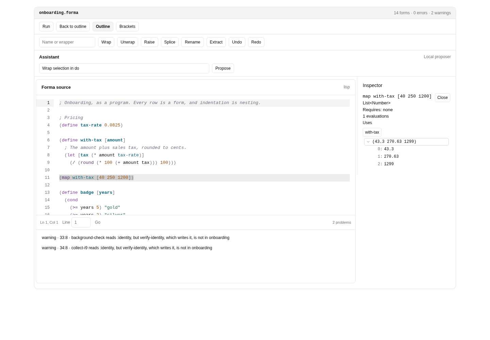
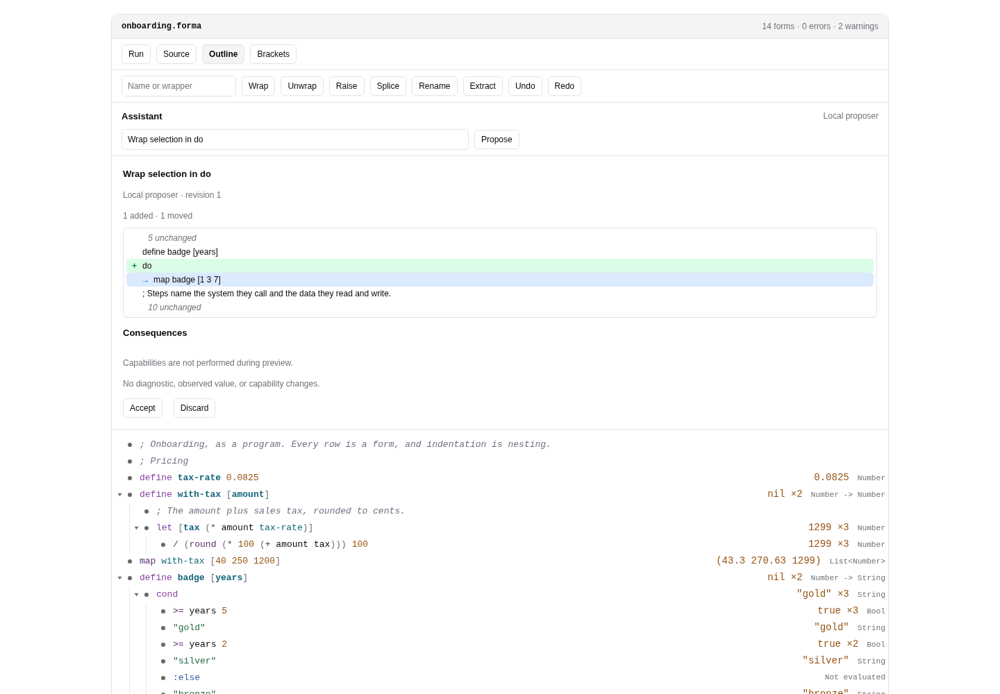
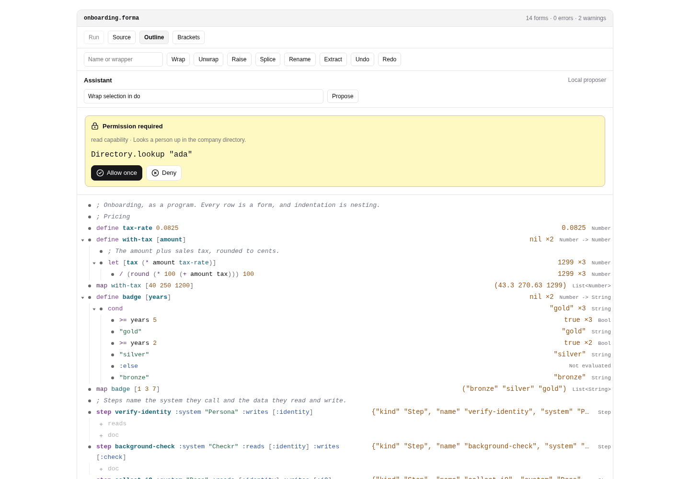

# @formalang/workbench

A structural Forma IDE in which the outline is the program, built with
[Foldkit](https://github.com/foldkit/foldkit) and
[Foldworks](https://github.com/bjacobso/foldworks). Every outline row is one
Forma form. The [design note](../../docs/workbench.md) describes how it is
built.

## Screenshots

These captures show the standalone app running the real onboarding program.

**The outline is the program.** Rows show observed values and inferred types.
The inspector expands a retained collection, and descriptor slots offer missing
clauses as placeholders.



**One document, two views.** The source pane shares the outline's analysis and
highlights the inspected form. Located workflow warnings appear below the editor.



**Review structural changes.** The local assistant proposes a wrapper around the
focused form. The tree diff and analyzed consequences are visible before Accept;
the resulting edit can be undone in one step.



**Approve capabilities before they run.** Evaluation pauses at the directory
lookup and shows its arguments and description. This demo uses simulated
directory and chat capabilities; reads and writes each require approval.



## Mounting the workbench

The workbench is a Foldkit submodel. An application mounts it and provides
the language host as a resource:

```ts
import { Runtime } from "foldkit";
import { TsLanguageHost } from "@formalang/host/ts-host";
import { FormaHost, Workbench } from "@formalang/workbench";

const config = { sourceId: "program.forma", preludes: [], capabilities: [] };

Runtime.run(
  Runtime.makeElement({
    Model: Workbench.Model,
    init: () => Workbench.init({ id: "workbench", title: config.sourceId, source }),
    update: Workbench.update,
    view: Workbench.view,
    container: document.getElementById("root"),
    resources: FormaHost.layer(new TsLanguageHost(), config),
  }),
);
```

Import `@foldworks/ui/base.css`, a Foldworks theme, and
`@formalang/workbench/styles.css`, and configure the StyleX compiler as
`@foldworks/ui` describes.

## Using the workbench

The demo mounts `Workspace`, a project wrapper around the single-document
`Workbench`. Choose Onboarding workflow, Functions & collections, or Pricing
modules. File drafts, outline/source undo histories, and REPL history stay in
memory when switching files or projects. Add file creates a module; Reset
example restores the bundled files. Reloading the page discards drafts.

Modules use explicit `(export name)`, `(import "./file.forma" [name])`,
`(import "./file.forma" :as alias)`, and `(export-from "./file.forma" [name])`.
Files load without running their application expressions. F12 or Definition ↗
at a symbol opens its original declaration, including through namespaces and
re-exports; the inspector's Uses links do the same. Back returns to the caller.

The REPL evaluates expressions using the active file's pure definitions and
the current project drafts. Ctrl/⌘+Enter submits multiline input. Successful
scratch definitions remain available to later entries and can be redefined.
Each entry replays those definitions in a fresh session, so changes to files
take effect on the next submission. Application expressions and definitions
known to require capabilities are omitted from the file context. The REPL
performs no capabilities; use Run in authoring for the approval flow. Clear
discards the transcript and scratch definitions.

Applications can mount the same project experience:

```ts
import { Workspace } from "@formalang/workbench";

const projects: readonly Workspace.Project[] = [{
  id: "pricing",
  title: "Pricing",
  description: "A small module project",
  entry: "main.forma",
  files: [
    { sourceId: "main.forma", source: '(import "./math.forma" [double]) (double 21)' },
    { sourceId: "math.forma", source: '(export double) (define double [x] (+ x x))' },
  ],
  repl: "(double 10)",
}];

Runtime.run(Runtime.makeElement({
  Model: Workspace.Model,
  init: () => Workspace.init({ id: "workbench", projects }),
  update: Workspace.update,
  view: Workspace.view,
  container: document.getElementById("root"),
  resources: Workspace.layer(new TsLanguageHost(), projects),
}));
```

Each project can supply `config` with its own preludes, checks, proposer, and
capabilities. No file's definitions become implicit globals in another file.

Edit a row's text, and use Return, Tab, and Shift+Tab to change the outline.
Fold and hoist with the outliner's controls. Outline and Brackets are two
notations for the same tree. Source opens the Foldworks code editor over the
same document; malformed source keeps the last valid outline available.

Values and types appear beside rows. Click a row's accessory to inspect its
value, requirements, definitions, and uses. Structured evaluation values load
through retained host handles. Domain forms show their elaborated payloads.
Ctrl+Shift+Space opens keyboard hover; Ctrl+Space offers scoped completions.
Descriptor placeholders insert the slot template as one undoable step.

Focus a row or select several, then choose a refactoring. The input supplies
the wrapper head or the new name for Rename and Extract. Assistant requests
such as “wrap selection in do” produce a TreeDiff and analyzed consequences.
Accept applies one undo step; Discard leaves the program unchanged. Run pauses
at each capability so the person can approve or deny it. Live analysis and
proposal previews never perform capabilities.

## Optional model proposer

The default is local and deterministic. An application can explicitly create
an adapter while supplying an Effect `LanguageModel` layer:

```ts
import { Effect } from "effect";
import { modelProposer } from "@formalang/workbench";

// languageModelLayer is the application's chosen provider, configured separately.
const proposer = await Effect.runPromise(
  modelProposer("My configured model").pipe(Effect.provide(languageModelLayer)),
);
const resources = FormaHost.layer(new TsLanguageHost(), { ...config, proposer });
```

Model output uses the same edit-script schema and host validation as the local
proposer. The person reviews its diff and consequences before applying it.
No provider is installed, no key is required, and no network call occurs by
default. Runtime resources own host sessions and close them on disposal.

## Foldworks

The workbench needs Foldworks primitives that are not published yet:
`@foldworks/outliner` and `@foldworks/text-intelligence` 0.1.0,
`@foldworks/ui` 0.3.0, `@foldworks/code-editor` 0.2.0, and
`@foldworks/agent` 0.2.0. Until they are, the package is private, and a
Foldworks checkout can be linked for development:

```sh
# In a sibling Foldworks checkout:
git checkout main
pnpm install && pnpm build:packages
# Here:
FOLDWORKS_DIR=../foldworks pnpm foldworks:link
pnpm install
pnpm workbench
```

Linking rewrites `pnpm-lock.yaml` with local paths. Do not commit it;
`pnpm foldworks:unlink` restores it.

Validated with Foldworks main at `695695e`. The
manifest ranges describe the minimum intended releases, while that unpublished
checkout currently has older version numbers. Foldkit and @foldkit/ui are
0.156.0, Effect is 4.0.0-rc.112, and StyleX is 0.19.0. The workbench has no
local Foldworks patches. Once the primitives are released, unlink, generate
a registry lockfile, recheck, and remove `private` before publication.

CI, deployment, and release build jobs first validate the existing registry
dependencies with a frozen install, then build the pinned Foldworks commit and
link its packages for that job. Release metadata jobs install only the registry
dependencies, and release versioning regenerates only their lockfile. The
temporary tarballs, hook, and linked lockfile changes are never committed.
Once the workbench is public and its release lockfile exists, all jobs use the
full frozen registry install.

Known first-release limits: evaluation stops at the first failure, observation
has no step trace, host calls have no exact dynamic source span, operational
Effect programs are typed but not executed, and files are not
persisted. See the design note for the language-service follow-ups.
